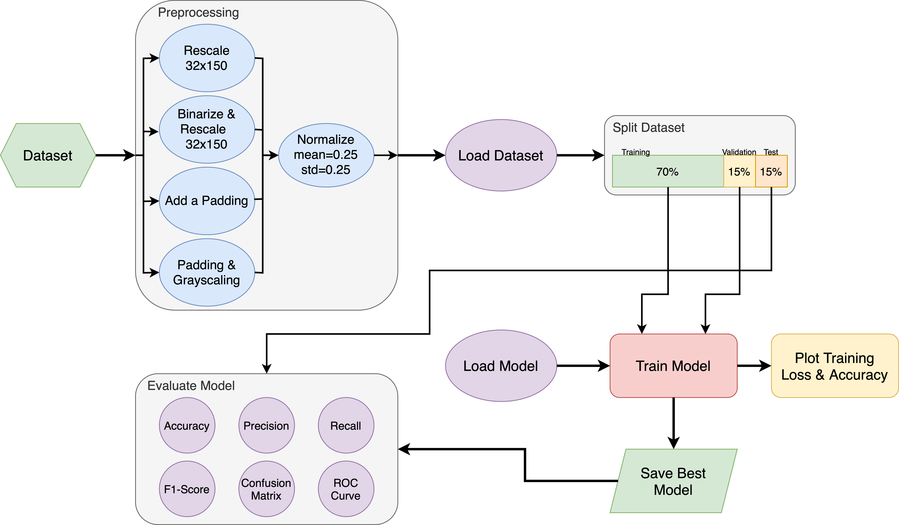

# Document Image Analysis - Font Classification

## 1 Information

### 1.1 Authors:
* Davide Morelli
* Mattéo Bonvin

### 1.2 Project Overview
The goal of this project is to classify words from 15 (initially) different fonts.

In the following image, we can see the general workflow needed to be done in order to solve the task.

### 1.3 Workplan and Milestones
| Date     | What to do                                                                   |
|----------|------------------------------------------------------------------------------|
| March 12 | Presentation of challenges, initial discussion and team building             |
| March 19 | Definitive task assignments within groups and initial protocol specification |
| April 9  | First protocol with precise evaluation protocol                              |
| April 14 | Definitive protocol specification and milestones                             |
| April 16 | Delivery of first trivial end-to-end experiment                              |
| Mai 7    | Delivery of final implementation with extensive results                      |
| Mai 12   | Deadline for report                                                          | 
| Mai 14   | Results improvements                                                         |
| Mai 21   | Oral presentations and final discussions                                     |
| Mai 28   | Conclusion, catch up if needed                                               |

## 2 Initial Idea
Our first idea is to achieve the font classification using a ML model.

### 2.1 First look at the dataset
The dataset (`fonts/`) is composed of 15 different folders, each one containing 1'000 images.

From an initial look at the different images, we can say that each font contains images of word of different colors, and
the words from a font to another are different in general (there could be some cases that some fonts contain the same word,
but we can't take that as an absolute truth).

### 2.2 Principal difficulties
The principal difficulties that we can see are:
* Correctly loading the dataset
* Preprocessing the images
* Choosing the right model
* Evaluating the model

### 2.3 Evaluation metrics
We can use a handful of metrics to evaluate the performance of our model. The ones we are choosing are:
* Accuracy: the ratio of correctly predicted observation to the total observations
* Precision: the ratio of correctly predicted positive observations to the total predicted positive observations
* Recall: the ratio of correctly predicted positive observations to the all observations in actual class
* F1-score: the weighted average of Precision and Recall
* Confusion matrix (15x15 matrix): a table used to describe the performance of a classification model
* ROC curve: a graphical plot that illustrates the diagnostic ability of a binary classifier system as its discrimination threshold is varied

### 2.4 Workload estimation and task assignment
The main tasks that we can see are:
* Data loading and preprocessing
* Model selection and training
* Model evaluation

We can assign the tasks as follows:
* Person 1: Data loading and preprocessing
* Person 2: Model selection and training
* Both: Model evaluation

## 3 Workflow
The following image shows the general workflow needed to solve the task.

The main steps are:
* Preprocessing the data
  * Four different options:
    * Rescale the images,
    * Binarize the images and rescaling them,
    * Padding the images
    * Grayscale the images and padding them
  * Normalize the images
* Loading the dataset
* Splitting the dataset
  * Training set
  * Validation set
  * Test set
* Loading the model
* Training the model
* Saving the model
* Evaluating the model
  * Accuracy
  * Precision
  * Recall
  * F1-score
  * Confusion matrix: 
  * ROC curve: in pytorch, we can use the `sklearn.metrics.roc_curve` function to get the ROC curve, and it's computed using the `roc_auc_score` function.

## 4 Data Loading and Preprocessing
The first step is to load the data and preprocess it in order to be able to use it in the model.

### 4.1 Data Loading
The data is loaded using the `tf.keras.preprocessing.image_dataset_from_directory` function, which allows us to load the data
directly from the directory, and to split it into training and validation sets.

### 4.2 Data Preprocessing
The data is preprocessed using the following step:
* Image adaptation:
    * Resizing the images to 32x150 pixels
    * Binarizing the images
    * Padding the images
    * Padding the images and binarizing them
* Normalizing the images

## 5 Model Selection and Training
The following table shows the different models that we are going to use to solve the task, with some information about them.

| Model name            | # Parameters | GFLOPS |
|-----------------------|--------------|--------|
| SqueezeNet1_1         | 1.2M         | 0.35   |
| ShuffleNet_V2_X0_5_V1 | 1.4M         | 0.04   |
| MobileNet_V3_Small    | 2.5M         | 0.06   |
| EfficientNet_B1_V2    | 7.8M         | 0.69   |
| ResNet18_V1           | 11.7M        | 1.81   |

More information about the models can be found here: [TorchVision Models](https://pytorch.org/vision/stable/models.html)

We can also work with different sizes of dataset:
* 50 images per font
* 100 images per font
* 250 images per font
* 500 images per font
* 1000 images per font (Original dataset)

Or even with a different number of fonts:
* 5 fonts
* 10 fonts
* 15 fonts (Original dataset)
* 25 fonts
* 40 (45?) fonts

## 6 Results
For this, we evaluate each model with all the images of the dataset, and then we use the best model to evaluate the potential
differences between the different sizes of dataset.

### 6.1 Evaluation of the best preprocessing method
In the following table, we can see the results of the different models with the different preprocessing methods.
For this evaluation, we use the original dataset with 15'000 images, and the MobileNet_V3 model.

| Model name   | Preprocessing method | # total images | # images per font | # epochs | Accuracy (%) | Precision | Recall | F1-score | Training time (s) | Medium training time per epoch (s) |
|--------------|----------------------|----------------|-------------------|----------|--------------|-----------|--------|----------|-------------------|------------------------------------|
| MobileNet_V3 | Binarization         | 15'000         | 1'000             | 60       | 98.00        | 0.98      | 0.98   | 0.98     | 2'455.79          | 40.93                              |
| MobileNet_V3 | Grayscale Padding    | 15'000         | 1'000             | 60       | 98.53        | 0.99      | 0.99   | 0.99     | 9'292.17          | 154.87                             |
| MobileNet_V3 | Rescaling            | 15'000         | 1'000             | 60       | 98.80        | 0.99      | 0.99   | 0.99     | 2'332.99          | 38.88                              |
| MobileNet_V3 | Simple Padding       | 15'000         | 1'000             | 60       | 98.84        | 0.99      | 0.99   | 0.99     | 10'369.64         | 172.83                             |

The different models are saved as `<model_name>_font_classifier_<preprocessing_method>.h5` files in the `models/Preprocessing/` folder, so we can use them later to evaluate them.

From the results we can see that the preprocessing method doesn't change a lot. Since is best to preprocess the least possible
the images, we are going to use just the rescaling method.

So for the rest of the evaluation, we are going to use this method.

### 6.2 Evaluation of the original dataset with different models
In the following table, we can see the results of the different models with the original dataset.
The time taken for the training is to be taken with a grain of salt, as it can vary a lot depending on the machine used and what other tasks are running at the same time. But it
can give a general idea of the time needed to train the model, and which model is faster to train.

| Model name            | # total images | # images per font | # epochs | Accuracy (%) | Precision | Recall | F1-score | Training time (s) | Medium training time per epoch (s) |
|-----------------------|----------------|-------------------|----------|--------------|-----------|--------|----------|-------------------|------------------------------------|
| SqueezeNet1_1         | 15'000         | 1'000             | 60       | 97.02        | 0.97      | 0.97   | 0.97     | 1'708.33          | 28.47                              |
| ShuffleNet_V2_X0_5_V1 | 15'000         | 1'000             | 60       | 97.02        | 0.97      | 0.97   | 0.97     | 1'866.91          | 31.12                              |
| MobileNet_V3_Small    | 15'000         | 1'000             | 60       | 98.80        | 0.99      | 0.99   | 0.99     | 2'597.28          | 43.29                              |
| EfficientNet_B1_V2    | 15'000         | 1'000             | 60       | 98.89        | 0.99      | 0.99   | 0.99     | 10'840.12         | 180.67                             |
| ResNet18_V1           | 15'000         | 1'000             | 60       | 99.33        | 0.99      | 0.99   | 0.99     | 4'902.07          | 81.70                              |

The different models are saved as `<model_name>_font_classifier_.h5` files in the `models/DifferentModels/` folder, so we can use them later to evaluate them.

Based on the above table, all the models perform similarly, with the EfficientNet_B1_V2 model being the best one, with a 99.38% accuracy.
But the time taken to train the model is quite high, so we can use the MobileNet_V3_Small model, which has a 99.02% accuracy, and a smaller training time.

### 6.3 Evaluation of the different sizes of dataset
In the following table, we can see the results of the MobileNet_V3_Small model with different sizes of dataset.

In order to achieve this, we need to train the model with different sizes of dataset, and so we change the proportion of the dataset used for training, validation and testing.

| Model name         | % of total images | # total images | # images per font | # epochs | Accuracy (%) | Precision | Recall | F1-score | Training time (s) | Medium training time per epoch (s) |
|--------------------|-------------------|----------------|-------------------|----------|--------------|-----------|--------|----------|-------------------|------------------------------------|
| MobileNet_V3_Small | 5%                | 750            | 50                | 60       | 59.29        | 0.70      | 0.59   | 0.61     | 666.71            | 11.11                              |
| MobileNet_V3_Small | 10%               | 1'500          | 100               | 60       | 89.33        | 0.90      | 0.89   | 0.89     | 787.66            | 13.13                              |
| MobileNet_V3_Small | 20%               | 3'000          | 200               | 60       | 94.89        | 0.95      | 0.95   | 0.95     | 959.33            | 15.99                              |
| MobileNet_V3_Small | 50%               | 7'500          | 500               | 60       | 97.60        | 0.98      | 0.98   | 0.98     | 1'445.79          | 24.10                              |
| MobileNet_V3_Small | 100%              | 15'000         | 1'000             | 60       | 99.11        | 0.99      | 0.99   | 0.99     | 2'417.16          | 40.30                              |

The different models are saved as `<model_name>_font_classifier_<nb_images>.h5` files in the `models/DatasetSize/` folder, so we can use them later to evaluate them.

### 6.4 Evaluation of the different number of fonts
In the following table, we can see the results of the MobileNet_V3_Small model with different number of fonts.

| Model name         | # total fonts | # images per font | # epochs | Accuracy (%) | Precision | Recall | F1-score | Training time (s) | Medium training time per epoch (s) |
|--------------------|---------------|-------------------|----------|--------------|-----------|--------|----------|-------------------|------------------------------------|
| MobileNet_V3_Small | 5             | 1'000             | 60       | 99.73        | 1.00      | 1.00   | 1.00     | 1'214.89          | 20.25                              |
| MobileNet_V3_Small | 10            | 1'000             | 60       | 99.73        | 1.00      | 1.00   | 1.00     | 1'175.12          | 19.59                              |
| MobileNet_V3_Small | 15            | 1'000             | 60       | 99.07        | 0.99      | 0.99   | 0.99     | 2413.04           | 40.22                              |

The different models are saved as `<model_name>_font_classifier_<nb_classes>.h5` files in the `models/NbClasses/` folder, so we can use them later to evaluate them.

## 7. Who did what

* Davide :
   * Rescaling, Binarization, ReadMe, Runtime & Evaluations
* Mattéo :
   * Padding, White Padding, Powerpoints & Evaluations

